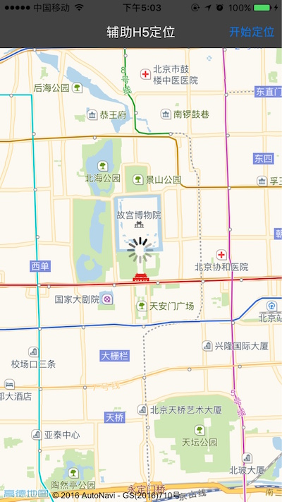
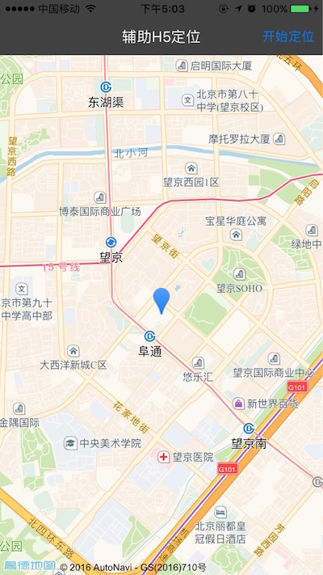
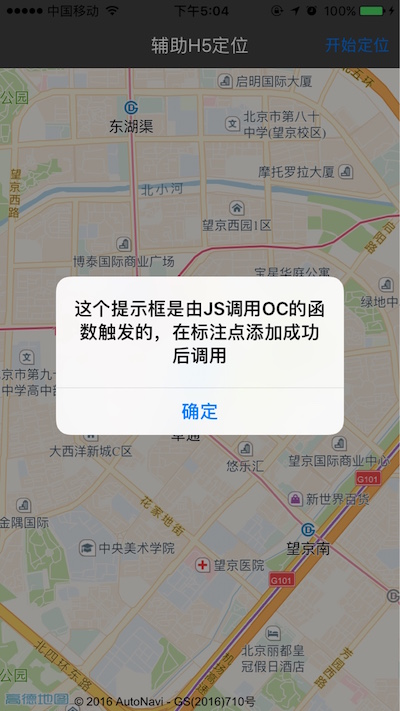

# iOS-assist-h5-location
辅助H5定位：通过定位SDK提供的单次定位接口获取单次定位结果，将定位结果打点在H5地图上。实现了Objective－C和JavaScript的相互调用。

## 前述 ##

- 工程是基于高德地图iOS定位SDK及JavaScript API实现
- [高德官方网站申请key](http://lbs.amap.com/api/ios-sdk/guide/create-project/get-key/#t1).
- 查阅[参考手册](http://a.amap.com/lbs/static/unzip/iOS_Location_Doc/index.html).

## 使用方法 ##

- 运行demo请先执行pod install --repo-update 安装依赖库，完成后打开.xcworkspace 文件
- 如有疑问请参阅[自动部署](http://lbs.amap.com/api/ios-sdk/guide/create-project/cocoapods/).

## demo运行效果图 ##





## 核心难点 ##

```
//Objective-C

//配置 WebView，让OC和JS可以互调。
- (void)configTheJSContext {
    self.context = [self.webView valueForKeyPath:(NSString *)WebViewKeyPath];
    JavaScriptObj *javaScript = [[JavaScriptObj alloc] init];  //自定义一个类来管理需要被JS调用的函数
    self.context[(NSString *)JavaScriptCallOCObj] = javaScript;
}

//OC调用JS，传入JS的函数名，所需参数依次组成的数组
- (JSValue *)letOCCallJSWithFunName:(NSString *)funName andArguments:(NSArray *)argumentsArray inJSContext:(JSContext *)jsContext {
    JSValue *function = [jsContext objectForKeyedSubscript:funName];
    JSValue *result = [function callWithArguments:argumentsArray];
    return result;
}

//进行单次定位请求
- (void)startLocationAction {

    [self cleanUpAction];

    self.loadingView.hidden = NO;

    __weak typeof(self) weakSelf = self;
    [self.locationManager requestLocationWithReGeocode:NO completionBlock:^(CLLocation *location, AMapLocationReGeocode *regeocode, NSError *error) {

        weakSelf.loadingView.hidden = YES;

        if (error) {

            NSLog(@"locError:{%ld - %@};", (long)error.code, error.localizedDescription);
            //如果为定位失败的error，则不进行后续操作
            if (error.code == AMapLocationErrorLocateFailed) {
                return;
            }
        }

        //得到定位信息后，调用JS函数addMarker，需要两个参数，经度和纬度，组成数组传入，其他函数详见map.html
        if (location) {
            [weakSelf letOCCallJSWithFunName:@"addMarker" andArguments:@[[NSNumber numberWithDouble:location.coordinate.longitude],[NSNumber numberWithDouble:location.coordinate.latitude]] inJSContext:self.context];
        }
    }];
}

//JavaScript:

function addMarker(longitude, latitude) {  //这个函数是留给OC调用的
    if (marker) {
        marker.setMap(null);
        marker = null;
    }
    marker = new AMap.Marker({
        icon: "http://webapi.amap.com/theme/v1.3/markers/n/mark_b.png",
        position: [longitude, latitude]
    });
    marker.setMap(map);
    map.setZoomAndCenter(14, [longitude, latitude]);
    JavaScriptCallOCObj.showInfoWhenAddMarkerSuccess(longitude,latitude);  //JS调用OC的函数
}


```

